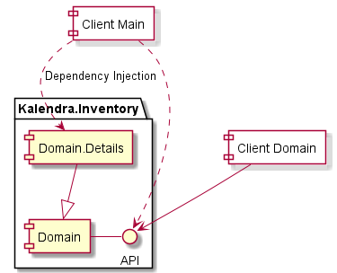
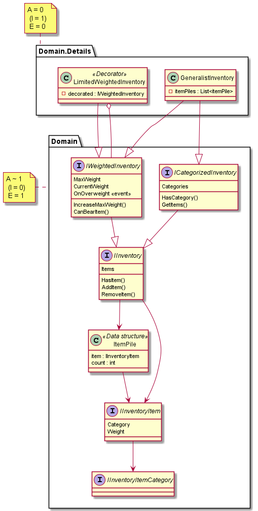

# Kalendra.Inventory

This is just a learning proposal of some Inventory-based library.  
It contains both abstractions and general implementations for most common inventory system & tools used in games.

## Architecture

 <!-- @IGNORE PREVIOUS: link -->

Any client, whether using this given implementations or some of theirs, might use the common interface.  
This is the API that Domain fixes as contracts.

That's why implementations are aisled in a details package, even though they are domain, model entities within an architectural way.

<!-- @IGNORE PREVIOUS: link -->

Using architectural patterns' terms:

- `Domain` component:
  - Defines interfaces.
  - It's mostly abstract.
    (contains interfaces and some data structures).
  - Has not efferent coupling at all.
  - Has afferent coupling.
  - Hence, it's stable. Then it won't usually change.

- `Domain.Details` component:
  - Implements `Domain` interfaces.
  - It's not abstract.
    (contains classes).
  - Has much of efferent coupling.
  - Has not afferent coupling.
  - Hence, it's unstable. Then it may constantly changes with zero-cost effort.
